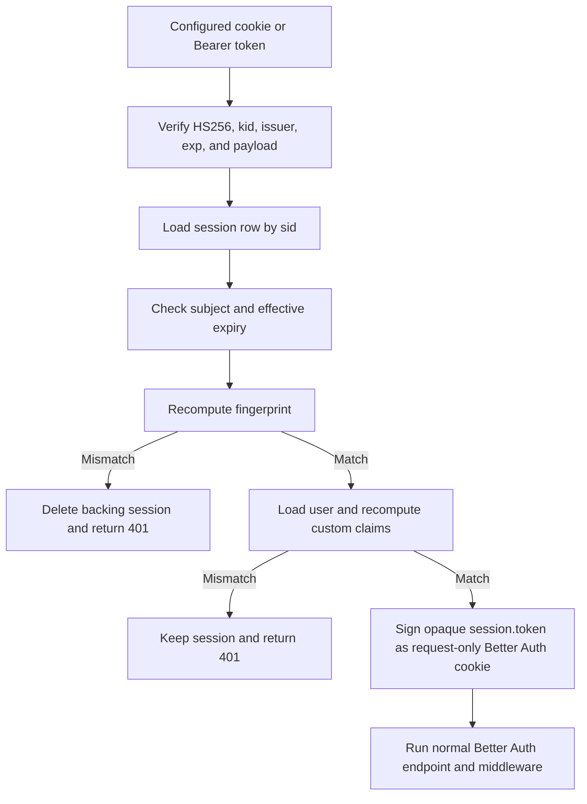

# Native Session-Centric JWT architecture

A Session-Centric JWT is a signed client transport for a server-side session, not a stateless replacement for one. `better-auth-scjwt` signs the Better Auth session-row ID and device constraints into a JWT while preserving Better Auth's database as the only authorization source of truth.

## Why retain a session row?

A purely stateless access token remains usable until its cryptographic expiry unless the application adds a revocation list. A canonical session row provides immediate revocation through the same operations Better Auth already uses for sign-out, password security, administration, and user deletion.

SCJWT intentionally performs a database read for each presented token. The JWT protects the pointer and selected claims from tampering; it does not remove the authoritative lookup.

| Property | Stateless JWT | Opaque database session | SCJWT |
|---|---|---|---|
| Client-verifiable structure | Yes | No | Yes |
| Immediate revocation | Requires extra state | Yes | Yes |
| Authoritative lookup per request | No | Yes | Yes |
| Device binding in credential | Optional | External | Built in |
| Better Auth native endpoint compatibility | Separate integration | Native | Native after verified request-cookie injection |

## Request flow

The injected cookie never replaces the response transport. It exists only in the current request headers so Better Auth's native `getSession`, sensitive-session middleware, account endpoints, and third-party plugins follow their standard path.

## Issuance and refresh flow

Better Auth's `setSessionCookie` records `ctx.context.newSession`. A generic after hook signs SCJWT whenever that value is present on a successful response. No endpoint names are assumed, so OAuth callbacks, magic links, passkeys, impersonation, and custom plugins receive the same behavior as email/password routes.

Better Auth `session.expiresIn` caps token lifetime. Better Auth `session.updateAge` controls refresh. A native refresh sets `newSession`, and the after hook emits a replacement SCJWT only for a successful 2xx result.

## Transport behavior

### Cookie

- Reads only `ctx.context.authCookies.sessionToken.name`.
- Replaces only a live native session-token response cookie.
- Preserves Better Auth's exact resolved name, secure prefix, path, domain, SameSite, HttpOnly, expiry, and partitioned attributes.
- Preserves session-data, account-data, and clear-cookie entries.

### Header

- Reads only `Authorization: Bearer`.
- Emits `set-auth-token` and exposes it through CORS exactly once.
- Removes live session-token, session-data, and `dontRemember` cookies.
- Preserves account-data and clear-cookie entries.
- Requires the client to delete stored Bearer state after logout or revocation.

Transport selection also defines precedence. The unselected source is ignored rather than used as a fallback.

## Claims

Core claims are `iss`, `sub`, `fp`, `iat`, `exp`, and `sid`. `getCustomClaims` may add bounded JSON values. The resolver receives the authoritative session and user plus the current `Request` when one exists.

Custom claims are visible signed data, not encrypted profile storage. The implementation limits count, encoded size, nesting, types, and reserved names. Verification reruns the resolver and requires exact JSON equality. This turns current roles or entitlements into short-lived assertions without creating a second revocation database.

## Fingerprints and proxies

`strict` mode hashes Better Auth's resolved IP, User-Agent, and `Sec-CH-UA-Platform`. `ip-only` hashes the same IP with canonical empty browser fields. Missing optional browser headers are therefore deterministic.

IP selection is delegated to Better Auth's `advanced.ipAddress.ipAddressHeaders`, `trustedProxies`, and `ipv6Subnet`. Keeping one resolver avoids divergent rate-limit, session-tracking, and SCJWT identities.

## Storage invariant

SCJWT must be able to resolve and delete a canonical database row immediately. Initialization rejects:

- configurations without a Better Auth database;
- `secondaryStorage` configurations unless `session.storeSessionInDatabase: true`.

This is deliberate. A secondary-store-only cache cannot satisfy the plugin's database-backed revocation contract.

## Key rotation

Plain Better Auth `secret` produces an HS256 token without `kid`. Better Auth versioned `secrets` produces a token with the current version in `kid`. Verification selects that exact retained version, allowing rotation without accepting unknown key IDs.

## Verification inventory

- `test/native-session.test.ts`: cookie/header transport, native `getSession`, custom secure prefixes, precedence, callback issuance, failure suppression, core sign-out.
- `test/custom-claims.test.ts`: issuance/refresh resolver calls, JSON limits, strict default payload, dynamic mismatch, secret rotation.
- `test/fingerprint-mode.test.ts`: missing headers, strict mismatch revocation, IP-only behavior, trusted proxies.
- `test/secondary-storage.test.ts`: database and secondary-storage initialization invariants.
- `test/admin-revoke-paths.test.ts`: Better Auth admin ban and session-revoke paths.
- [`REVOKE_AUDIT.md`](./REVOKE_AUDIT.md): Better Auth 1.7.6 deletion-path audit.
